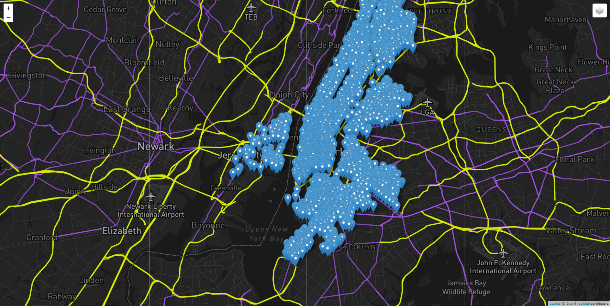

# City Bike Stations w/ Leaflet

### Use the Citi Bike API to get the status and location of every Citi Bike station in New York. We recommend completing the basic version before trying the advanced version of our mini project.

----
* **Basic Version**

    * Use the [Citi Bike station information endpoint](https://gbfs.citibikenyc.com/gbfs/en/station_information.json) to get information about the station names and locations. In your browser, take a moment to study the data that the endpoint sends back. Note the following:

        * Each object in the `stations` array has `station_id`, `name`, `capacity`, `lat`, and `lon` properties.
        * The [logic.js](static/js/logic.js) file contains coordinates that you can use to position a Leaflet map over New York City.

* Create a function named `createMap` that takes `bikeStations` as an argument. This function will create both the tile layer and an overlay with the pins for each station.

* Create a second function named `createMarkers` that will take `response` as an argument. This function will do the following:

    * Using the response from a future d3 call, loop through the stations, and create a marker to represent each station.
    * Give each marker a popup to display the name and capacity of its station.

* In the `createMarkers` function, pass the resulting bike markers to the `createmap` function as a `layerGroup`.

* Using d3, retrieve json data from the [Citi Bike station information endpoint](https://gbfs.citibikenyc.com/gbfs/en/station_information.json), and call the `createMarkers` function.

## Screenshots

